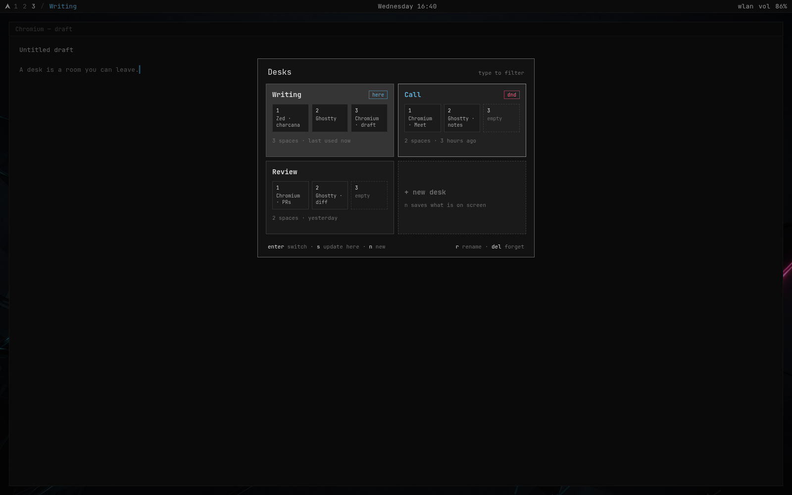

# Desks

```
      +---------+
      |  o   o  |
      |    ~    |
      +----+----+
     /|         |\
     \|_________|/
       ||     ||
      _||     ||_
```

Named-desk overlay for Omarchy Quattro. A desk is the current 1–10
workspaces, given a name. Switching parks this room onto named special
workspaces `special:omadesk-<id>-N` (the same kind of hidden space as
the scratchpad, so Super+Tab never lands there) and brings the other
room back onto 1–10. Each workspace is put back on the monitor it was
on; a missing display is skipped. The bar still shows 1 2 3. The
scratchpad itself (`special:scratchpad`) stays global and is never
parked, restored, or stored.



Live truth while the session is alive is parked window addresses. Two
Chromiums on two workspaces work during the day because we move those
addresses. A save stores class, exec, Chromium profile, terminal cwd and
command, and window size. After a reboot, switching into that desk
relaunches those windows (`chromium --profile-directory=… --new-window`,
a terminal with its directory and command, floating size and position).
Workspace tiles show the tiled layout from window geometry, with app
icons, two per row at the monitor's aspect ratio.

## Install

```sh
omarchy plugin add https://github.com/modoterra/omadesk.git --enable
```

From this checkout:

```sh
omarchy plugin add /home/hallas/Work/modoterra/omadesk --enable
```

There is no installer script. The plugin is QML + JavaScript only.

Put the chip next to the stock workspace numbers:

```sh
omarchy bar move com.mdtrr.omadesk --section left
```

The chip reads `/ Name` on a named desk, `Unsaved` when saved desks exist
but you are on the draft room, and `Desks` when nothing is saved yet.

## Summon

```sh
omarchy-shell shell toggle com.mdtrr.omadesk
```

Suggested bind: Super+D. Super+Space stays the Omarchy menu. Super+Shift+D
is Omarchy’s Docker TUI, so this plugin does not take that key.

```lua
o.bind("SUPER + D", "Desks", "omarchy-shell shell toggle com.mdtrr.omadesk")
```

## Keys

| Key | Action |
| --- | --- |
| Super+D | toggle overlay |
| / | start filter (Esc leaves) |
| j / k, arrows, h l | move cursor |
| 1–9 | jump to card |
| click a workspace tile | switch onto that workspace |
| drag a window pane onto another tile | move that window on this desk |
| drag a pane onto Empty | put it on the next free workspace |
| D / L on a workspace tile | toggle dwindle and scrolling |
| enter | switch, return to **Unsaved**, or start an empty unsaved desk on **+ New Desk** |
| n | save current as a named desk |
| s | update desk you are on |
| r | rename (display name; parking id stays) |
| e | extras (DND Leave/On/Off, launch missing after reboot, theme Leave or Set) |
| x | close every window on the highlighted desk (recipe stays) |
| o | open the recipe in the background (parked lots if you are on another desk) |
| del | forget, with confirm (parked windows return to 1–10) |
| esc | close (clear filter first if any) |

## Remove

```sh
omarchy plugin remove com.mdtrr.omadesk
```

Recipes live in `~/.config/omarchy/omadesk/desks.json`. Forget deletes the
recipe and brings that desk's parked windows back onto 1–10. The picker
marks **LIVE** when windows are still open (on 1–10 or parked), **DND**
when that desk turns do-not-disturb on, and **DRAFT** on the Unsaved card.
A **dead** desk is recipe only: `x` closes its windows, `o` launches them
in the background without switching, and switching into it after a reboot
also launches the saved windows if Launch Missing is on. Theme extras can
leave the current theme or run `omarchy theme set` when you switch into
that desk.

## Tests

```sh
node tests/test_model.js
omarchy plugin validate .
qmllint -I "$OMARCHY_PATH/shell" Overlay.qml BarWidget.qml
```

A Vite landing sits in `www/`. Nothing publishes it.

```sh
npm --prefix www test
npm --prefix www run build
```

## Site (`www/`)

Unused. The landing shows the same overlay shot as this README: keep
`preview.png` at the repo root and copy it to `www/public/preview.png`.
Intended Cloudflare Pages settings if it is wired later:

| Setting | Value |
| --- | --- |
| Root directory | `www` |
| Build command | `npm ci && npm run build` |
| Build output | `dist` |
| Production branch | `main` |
| Custom domain | `omadesk.mdtrr.com` |

## Security

Plugins run unsandboxed inside the long-lived Omarchy shell process, with
your user permissions. Review the code before you enable it. Hyprctl moves
windows and sets workspace layout. Apps launch with `uwsm-app`. Desk extras
can run `omarchy-shell notifications setDnd` and `omarchy theme set`.

## Community

Use common sense and decency. There is no formal code of conduct. We reserve the right to moderate this community to the extent of the law and the policy of the host. Write community@modoterra.xyz if you need us.
